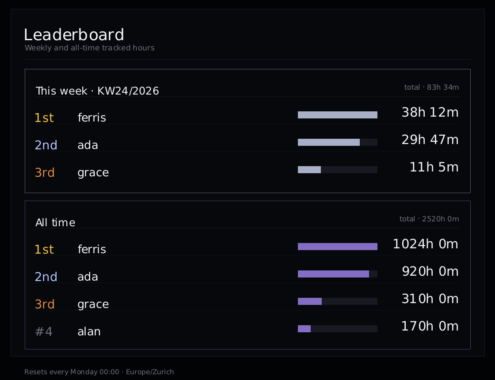
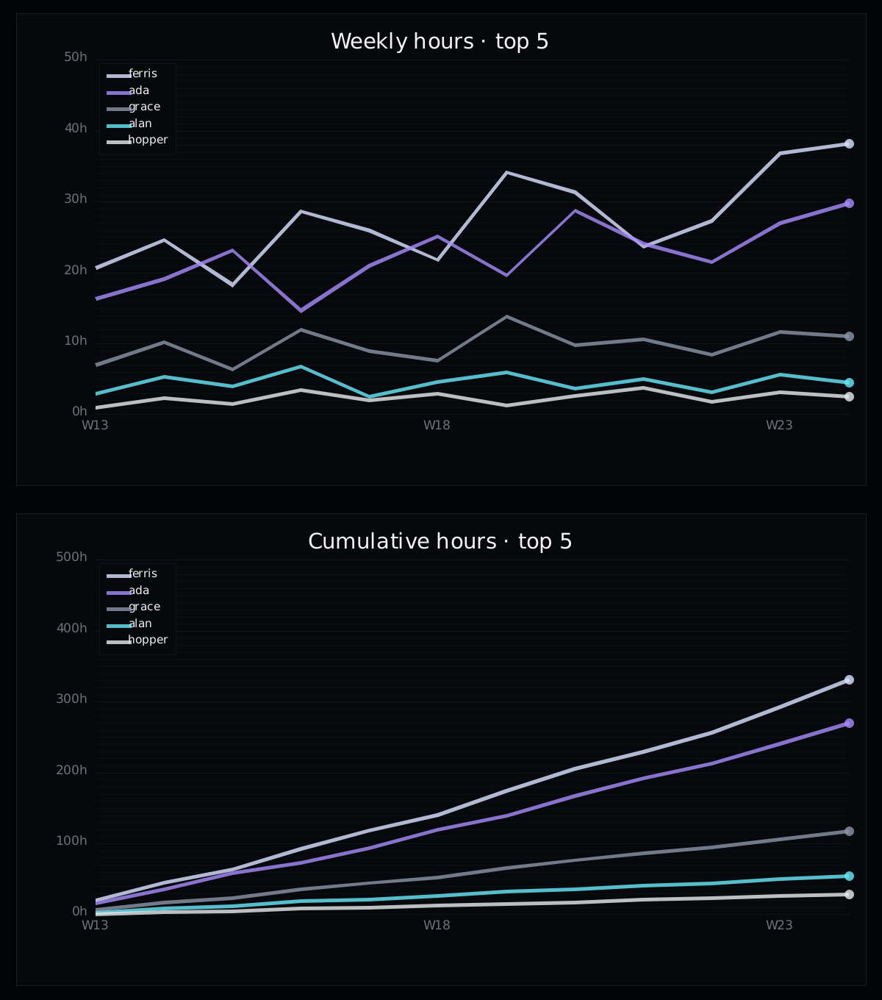
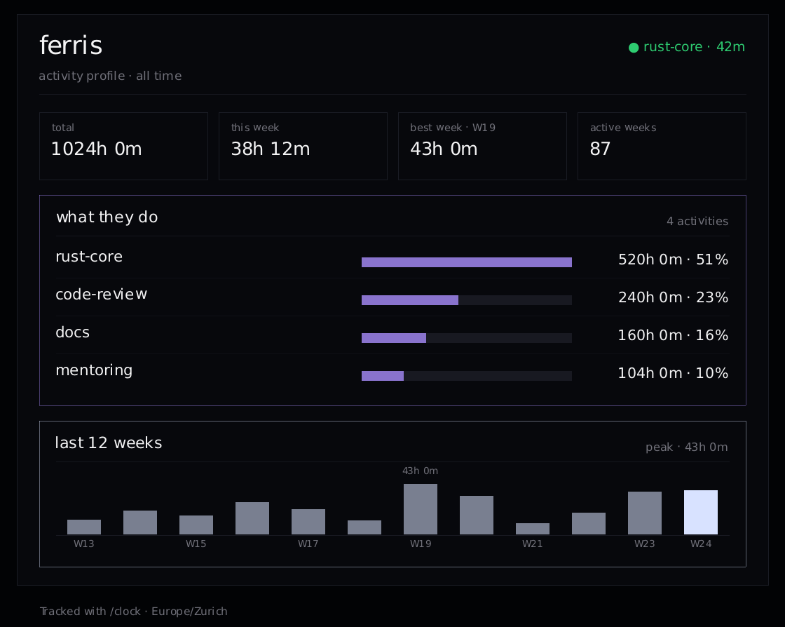

# ClockBot

> A Discord `/clock` bot that tracks who's working on what, resets weekly, and posts leaderboards, PNG charts, and earned roles.


ClockBot is a SQLite-backed Discord time tracker. Members run `/clock in <activity>` and `/clock out`; ClockBot keeps weekly and all-time leaderboards, activity breakdowns, and pure-Rust PNG line charts. Every Monday at 00:00 (Europe/Zurich) it posts a weekly report, archives the week, and assigns tiered Discord roles based on what each person actually worked on.

<p align="center">
  <br>
  <sub>The <code>/clock leaderboard</code> card (sample data)</sub>
</p>

## Quickstart

```bash
git clone https://github.com/lambdaf-org/clock
cd clock
export DISCORD_TOKEN=your-bot-token-here
cargo run
```

The bot opens its database at `/data/clock.db`, so make sure that path is writable (or run via Docker, below). On first launch it downloads a small sentence-embedding model from Hugging Face for role classification, then caches it.

### Create the bot

1. Create an application at https://discord.com/developers/applications
2. Under Bot settings, enable the **MESSAGE CONTENT** intent
3. Invite with scopes `bot` and `applications.commands`, with permissions: Send Messages, Embed Links, Attach Files (and Manage Roles plus Manage Nicknames if you want automatic role assignment)
4. Set `DISCORD_TOKEN` and run

`DISCORD_TOKEN` is loaded from a `.env` file if present.

### Configuration

| Variable | Required | Purpose |
| --- | --- | --- |
| `DISCORD_TOKEN` | yes | Bot token |
| `SUMMARY_CHANNEL` | optional | Channel ID for the weekly report and role announcements |
| `GUILD_ID` | optional | Guild ID; enables weekly role and nickname assignment |
| `ANCHOR_ROLE_ID` | optional | Role ID that generated roles are positioned above |

## Features

- **`/clock` workflow**: in, out, switch, and live status, all driven by simple chat commands.
- **Weekly resets**: every Monday 00:00 Europe/Zurich the week is summarized, archived, and cleared.
- **Leaderboards**: weekly and all-time rankings, rendered as a PNG card with a text fallback.
- **Profile cards**: `/clock user` (or `/clock me`) renders a per-member card with live status, stat tiles, all-time activity shares, and a 12-week trend.
- **Activity stats**: weekly and all-time breakdowns of top activities and per-person totals.
- **PNG line charts**: top 5 users by hours over 1 to 52 weeks, in `totals`, `cumulative`, or `both`.
- **Pure-Rust rendering**: charts use `plotters` with the `ab_glyph` backend and an embedded DejaVu Sans font, so the runtime image needs no system font packages.
- **Earned roles**: a local sentence-embedding model reads each person's activities and assigns a themed, tiered Discord role and chevron nickname for the week.
- **Name normalization**: activity names are lowercased, de-duplicated, and split on camelCase so `WorkSchool` and `workkkk` land in the right buckets.

## Commands

```
/clock in <activity>                          start tracking
/clock out                                    stop tracking, shows duration
/clock switch <activity>                      clock out and into a new activity
/clock status                                 your current session
/clock who                                    who's working right now
/clock leaderboard                            weekly + all-time rankings (alias: /clock lb)
/clock stats                                  weekly activity breakdown (top activities + per-person)
/clock alltime                                all-time activity stats for everyone (aliases: at, all-time)
/clock user [@user|name]                      activity profile card for a member
/clock me                                     your own profile card
/clock rename <old> > <new>                   rename and merge one of your activities
/clock chart [weeks] [totals|cumulative|both] PNG line chart of top 5 weekly hours
/clock help                                   command list
```

### `/clock chart` details

- `weeks`: number of weeks to plot (1 to 52, default `12`)
- mode:
  - `totals` (default): hours worked per week, one line per user
  - `cumulative`: running total of hours over the range
  - `both`: totals and cumulative together
- Always shows the **top 5 users** by total hours in the selected window. A chart needs at least 2 weeks of data.

Examples:

```
/clock chart
/clock chart 8
/clock chart 26 cumulative
/clock chart 12 both
```

<p align="center">
  <br>
  <sub><code>/clock chart</code> (sample data)</sub>
</p>

### `/clock user` profile cards

`/clock user [@user|name]` (or `/clock me` for your own) renders a profile card: live status, all-time and weekly stat tiles, what the member spends their time on, and a 12-week trend.

<p align="center">
  <br>
  <sub><code>/clock user</code> (sample data)</sub>
</p>

## How it works

The Monday loop runs in this order: assign roles from the live week, post the weekly report to `SUMMARY_CHANNEL`, then archive and clear the week. Role assignment groups each person's minutes per activity, embeds the activity text with a local `all-MiniLM-L6-v2` model, and scores it against seven work styles (architect, visionary, executor, analyst, ghost, strategist, maverick). Total weekly minutes set one of six tiers, which picks the role name, color, Unicode styling, and chevron nickname prefix. If the bot misses a Monday, it assigns roles from the last archived week on startup.

## Deployment

The included `Dockerfile` builds a slim Debian runtime image:

```bash
docker build -t clockbot .
docker run -e DISCORD_TOKEN=your-bot-token-here -v clockdata:/data clockbot
```

Mount a volume at `/data` to persist `clock.db` across restarts.

## Contributing

Lambdaforge is open source and contributions are welcome. Start with the [contributor guide](https://github.com/lambdaf-org/contributing), and see the org-wide [CONTRIBUTING](https://github.com/lambdaf-org/.github/blob/main/CONTRIBUTING.md) and [Code of Conduct](https://github.com/lambdaf-org/.github/blob/main/CODE_OF_CONDUCT.md).

## License

This repository does not yet include a `LICENSE` file, so default copyright applies for now. A license is coming soon. If you want to use or build on this before then, please open an issue.
